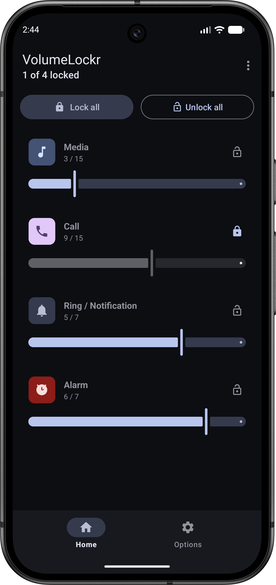
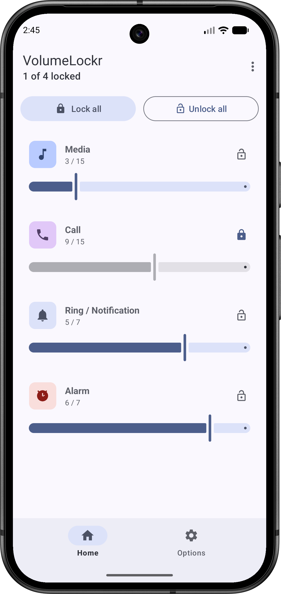

<p align="center">
  
</p>

<h1 align="center">VolumeLockr / 音量锁定器</h1>

<p align="center">
  <a href="https://www.gnu.org/licenses/gpl-3.0"></a>
  <a href="https://f-droid.org/packages/com.klee.volumelockr"></a>
  <a href="https://github.com/xunnv/VolumeLockr/actions/workflows/android.yml"></a>
  <a href="https://github.com/xunnv/VolumeLockr/releases"></a>
  
  
</p>

<p align="center">
  <b>简体中文</b> | <a href="#english">English</a>
</p>

---

VolumeLockr 是一款开源免费的音量锁定工具，可对 Android 设备每个音频流的音量进行独立锁定。锁定后，即使按下物理音量键或切换音频模式，音量始终保持不变。

<p align="center">
  
  &nbsp;&nbsp;
  
</p>

## 功能

- 独立锁定各个音频流：**媒体音量**、**闹钟音量**、**铃声 / 通知音量**、**通话音量**
- **勿扰模式**集成 — 检测铃声模式变化（静音、振动、正常）
- **仅允许降低**模式 — 防止意外调高音量
- **密码保护** — 修改锁定或关闭保护需要密码验证（AES-256 加密存储）
- **最近任务隐藏** — 在多任务界面隐藏应用（基于 `AppTask.setExcludeFromRecents`，支持小米 / 红米 MIUI）
- **前台服务** — 应用后台运行时持续保持音量锁定
- **开机自启** — 设备重启后自动恢复锁定（60 秒延迟避开音频 HAL 初始化）
- **无广告、无追踪、无网络权限**
- **支持 4 种语言**：简体中文、English、Français、Русский

## 安装

### GitHub Release（推荐）

前往 [Releases 页面](https://github.com/xunnv/VolumeLockr/releases) 下载最新 APK 直接安装。

### F-Droid

<a href="https://f-droid.org/packages/com.klee.volumelockr">
  
</a>

### 从源码编译

**环境要求**
- JDK 17+
- Android SDK (API 35+)

```bash
# 克隆仓库
git clone https://github.com/xunnv/VolumeLockr.git
cd VolumeLockr

# 编译 Debug 版本
./gradlew assembleDebug

# 编译 Release 版本（未签名）
./gradlew assembleRelease

# 通过 ADB 安装
adb install app/build/outputs/apk/release/app-release.apk
```

**Release 签名**

1. 创建 `release/keystore.properties`（已加入 .gitignore）：
```properties
storeFile=release/release.keystore
storePassword=你的密码
keyAlias=你的别名
keyPassword=你的密码
```
2. 将密钥文件放在 `release/release.keystore`
3. 运行 `./gradlew assembleRelease`，会自动检测并签名

## 使用说明

1. 打开应用，为每个音频流设置目标音量
2. 根据提示授予"勿扰模式"访问权限（铃声模式检测需要）
3. 前台服务在后台自动保持锁定
4. 可在设置中**开启密码保护**防止他人修改
5. 可在设置中**隐藏最近任务**（支持小米 / 红米）

## 技术栈

| 层级 | 技术 |
|-------|-----------|
| 语言 | Kotlin |
| UI | Material Design 3, Navigation Component |
| 依赖注入 | 手动（无框架） |
| 持久化 | SharedPreferences + EncryptedSharedPreferences |
| 构建 | Gradle (Kotlin DSL), Version Catalog |
| CI/CD | GitHub Actions (assemble + detekt + test) |
| 代码检查 | Detekt |
| 许可证 | GPL-3.0 |

## 参与贡献

欢迎提交 PR！详见 [CONTRIBUTING.md](CONTRIBUTING.md)，包括：

- 提交规范（Conventional Commits）
- PR 流程
- 代码风格
- 翻译指南

## 译者

- 简体中文 (zh-CN)：[@liket](https://github.com/liket)
- Français (fr-FR)：Jonathan Klee
- Русский (ru-RU)：Jonathan Klee

想添加新的语言？请查看 [CONTRIBUTING.md#translations](CONTRIBUTING.md)。

## 许可证

本项目采用 [GNU General Public License v3.0](LICENSE) 许可证。

本 Fork 基于原作者 [jonathanklee/VolumeLockr](https://github.com/jonathanklee/VolumeLockr)，遵循 GPL-3.0 开源协议。

---

<p align="center">
  <a href='https://ko-fi.com/Y8Y5191O6Z' target='_blank'>
    
  </a>
</p>

---

<h2 id="english">English</h2>

VolumeLockr allows you to control your Android device volume levels and set persistent locks for each audio stream. Once locked, the volume stays fixed — even when pressing hardware buttons or switching audio modes.

## Features

- Lock individual audio streams: **Media**, **Alarm**, **Ring / Notification**, **Call**
- **Scheduled volume lock** — auto-lock volumes by time slot with multi-slot, weekday/weekend, and per-stream targets
- **JSON import/export** — backup and restore schedule configurations
- **Temporary unlock** — manually override schedule for 15/30/60/120 minutes
- **Do Not Disturb** integration — detect ringer mode changes (Silent, Vibrate, Normal)
- **Lower-only mode** — prevent accidental volume increases
- **Password protection** — require a password to change locks or disable protection (AES-256 encrypted)
- **Hide from recents** — remove from recent tasks (uses `AppTask.setExcludeFromRecents`, works on Xiaomi/Redmi)
- **Foreground service** — keep locks active when app is in background
- **Auto-start on boot** — re-apply locks after device reboot (60s delay for audio HAL init)
- **No ads, no tracking, no network permissions**
- **Available in 4 languages**: 简体中文, English, Français, Русский

## Installation

### GitHub Release

Download the latest APK from the [Releases page](https://github.com/xunnv/VolumeLockr/releases).

### F-Droid

<a href="https://f-droid.org/packages/com.klee.volumelockr">
  
</a>

### Build from Source

```bash
git clone https://github.com/xunnv/VolumeLockr.git
cd VolumeLockr
./gradlew assembleRelease
adb install app/build/outputs/apk/release/app-release.apk
```

## License

[GNU General Public License v3.0](LICENSE)

This fork is based on [jonathanklee/VolumeLockr](https://github.com/jonathanklee/VolumeLockr) and follows the GPL-3.0 license.